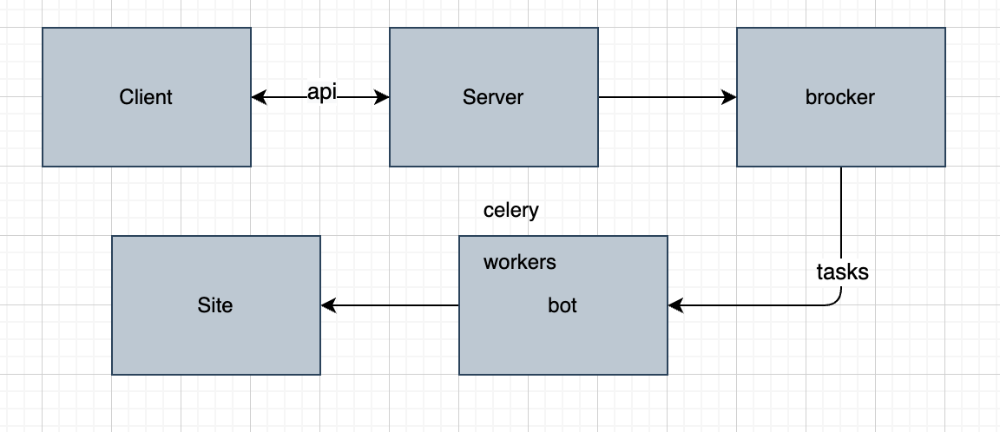
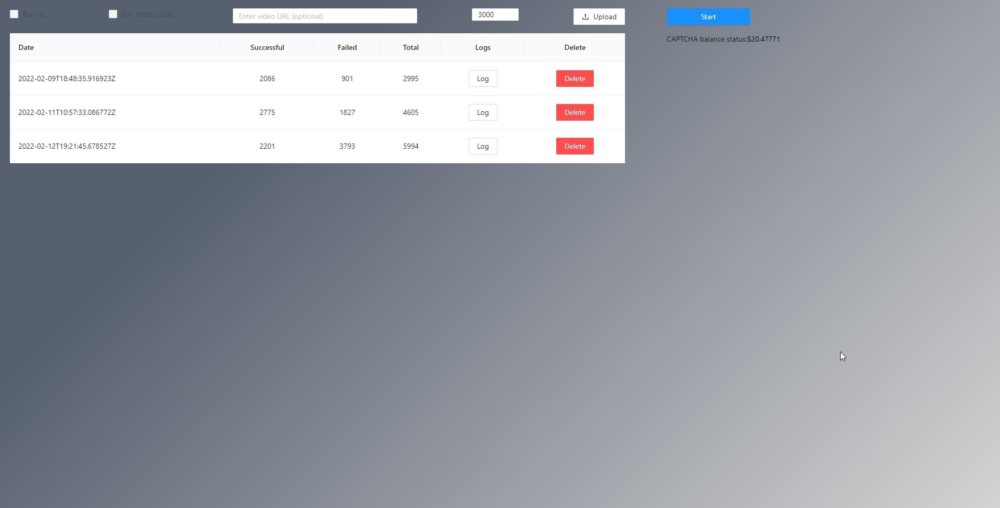
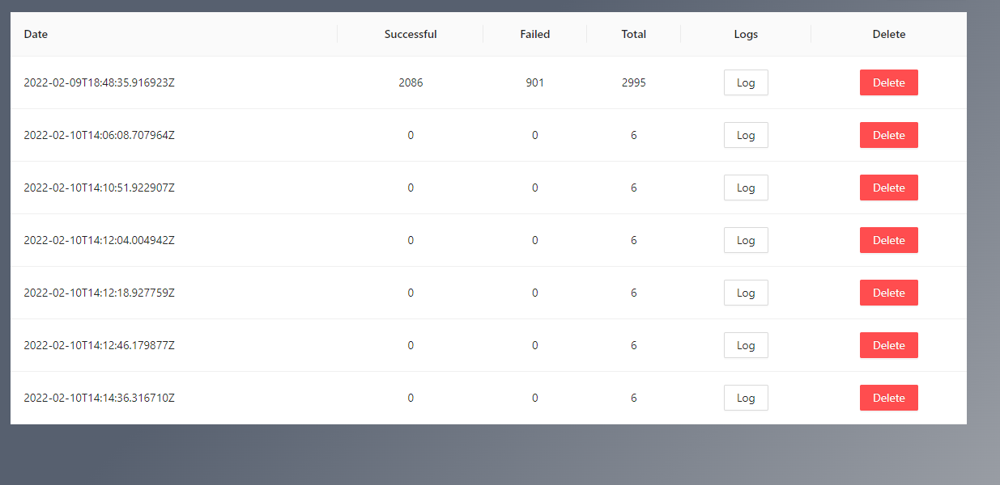
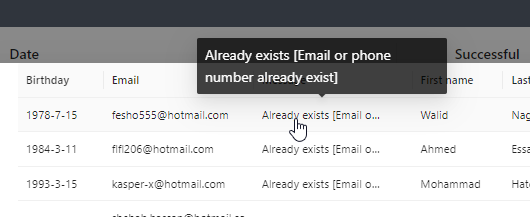

### **General information**
A project for registering accounts on the website - https://mywinstonegypt.com.\
When registering the bot solves the captcha and creates 6000 accounts per hour.\
The .env.example file contains parameters for setting up the project.\
The project uses celery to raise and run 50 bots simultaneously. (can be changed in docker-compose.yml)

### **Used libs** 
* django
* react
* celery
* redis
* postgres

**Project architecture**

**Project UI**\
*Home page*

*Home page with auto run tasks*

*Task log info*

**Deploy**

Step 1. Install docker and docker-compose
- `sudo apt update -y`
- `sudo apt upgrade`
- `sudo apt install apt-transport-https ca-certificates curl software-properties-common`
- `curl -fsSL https://download.docker.com/linux/ubuntu/gpg | sudo apt-key add -`
- `sudo add-apt-repository "deb [arch=amd64] https://download.docker.com/linux/ubuntu bionic stable"`
- `sudo apt update`
- `sudo apt install docker-ce`
- `sudo curl -L "https://github.com/docker/compose/releases/download/1.27.4/docker-compose-$(uname -s)-$(uname -m)" -o /usr/local/bin/docker-compose`
- `sudo chmod +x /usr/local/bin/docker-compose`

Step 2. Project deploy

NOTE: Execute commands in the project folder!
- **up project**: `docker-compose up --build -d`
- **down project:** `docker-compose down`

